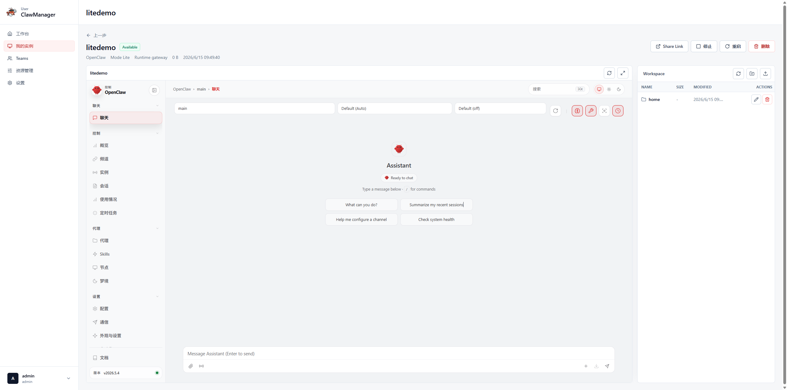
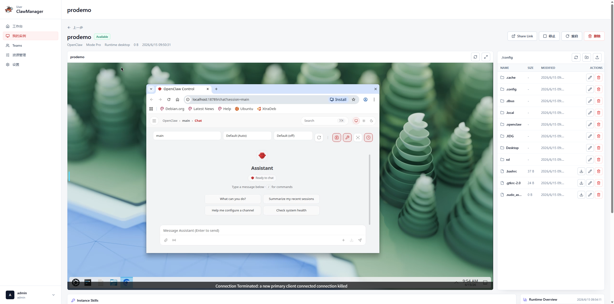

# ClawManager

  

  ClawManager は、AI エージェントインスタンス管理のための Kubernetes ネイティブなコントロールプレーンです。ガバナンス付きの AI アクセス、ランタイムオーケストレーション、そして複数の Agent Runtime にまたがる再利用可能なリソース管理を提供します。

  <strong>言語:</strong>
  <a href="./README.md">English</a> |
  <a href="./README.zh-CN.md">简体中文</a> |
  日本語 |
  <a href="./README.ko.md">한국어</a> |
  <a href="./README.de.md">Deutsch</a>

  
  
  
  
  

  <a href="#product-tour">製品紹介</a> |
  <a href="#team-workspaces">Team ワークスペース</a> |
  <a href="#ai-gateway">AI Gateway</a> |
  <a href="#agent-control-plane">Agent Control Plane</a> |
  <a href="#runtime-integrations">Runtime 連携</a> |
  <a href="#resource-management">リソース管理</a> |
  <a href="#get-started">はじめに</a>

  

<h2 align="center">60 秒でわかる ClawManager</h2>

  エージェントの高速プロビジョニング、Skill 管理とスキャン、AI Gateway ガバナンスを短時間で確認できます。

## 最新情報

最近の重要な製品アップデートとドキュメント更新です。

- [2026-06-14] Lite / Pro ランタイムモードとロールアウト対応を追加しました。Lite インスタンスは共有 gateway runtime pool で動作し、Pro インスタンスはより強い分離のため専用 desktop deployment を維持します。
- [2026-05-18] Team ワークスペース MVP の紹介とプレビューを追加しました。ワンクリック Team 作成、OpenClaw メンバーのオーケストレーション、Redis Team Bus 注入、共有ストレージ、メンバー状態、タスク配布、イベント/結果ビューをカバーします。
- [2026-04-29] Hermes Runtime 連携を追加しました。Webtop ベースのインスタンス作成、Agent Control Plane 登録、AI Gateway 注入、channel と skill のブートストラップ、`.hermes` のインポート/エクスポートに対応しています。詳しくは [Hermes Runtime Guide](./docs/hermes-runtime-agent-development.md) を参照してください。
- [2026-04-08] プラットフォームに Skill 管理と Skill スキャンのワークフローを追加しました。詳細は [Merged PR #52](https://github.com/Yuan-lab-LLM/ClawManager/pull/52) を参照してください。
- [2026-03-26] AI Gateway ドキュメントを更新し、モデルガバナンス、監査とトレース、コスト計算、リスク制御の説明を強化しました。詳しくは [AI Gateway Guide](./docs/aigateway.md) を参照してください。
- [2026-03-20] ClawManager は、AI エージェントワークスペース向けのより広いコントロールプレーンへと進化し、ランタイム制御、再利用可能なリソース、安全スキャンのワークフローを強化しました。

> ClawManager があなたのチームに役立つなら、ぜひ Star を付けて、より多くのユーザーや開発者に届くよう応援してください。

  

## WeChatコミュニティグループ

ClawManager オープンソースコミュニティの WeChat グループです。プロダクト更新の確認、使い方の相談、コントリビューター同士の交流にご活用ください。

  

## 製品紹介

ClawManager は、AI エージェントインスタンスの運用を Kubernetes に持ち込み、そのランタイム基盤の上に 3 つの高次なコントロールプレーンを重ねます。チームはこれを使って AI アクセスを統制し、Agent を通じてランタイム動作を編成し、スキャン可能で再利用可能な channel と skill を用いてワークスペース機能を提供できます。

次のようなチームに向いています。

- 複数ユーザー向けに AI エージェントインスタンスを運用するプラットフォームチーム
- ランタイムの可観測性、コマンド配布、 desired state 管理が必要な運用チーム
- 手作業の設定ではなく、再利用可能なリソースで Agent ワークスペースを届けたい開発チーム

## Team ワークスペース

Team ワークスペースは、ClawManager を単一インスタンス運用から複数 Agent の協調ランタイム管理へ拡張します。ユーザーは Team を作成し、1 人の Leader と複数のメンバーを割り当て、ClawManager にメンバー Runtime のプロビジョニング、協調設定の注入、タスクとイベント状態の可視化を任せることができます。

現在の MVP は、OpenClaw メンバーのオーケストレーションと Redis Team Bus のループに焦点を当てています。

- 検証済みの Leader / メンバー roster によるワンクリック Team 作成
- Team ロール、メンバー ID、コントロールプレーン URL、共有マウント設定を持つメンバー Runtime Pod の作成
- 管理された環境変数と Secret 参照による Redis inbox、events、presence、DLQ key の注入
- コンテキスト、成果物、スナップショット、タスク結果のための共有 PVC を `/team` にマウント
- Leader デスクトップ、Team チャット、メンバー一覧、配布パネル、タスク進捗、イベント/結果履歴をまとめた Team 詳細ビュー
- Team、メンバー、タスク、イベントを DB の権威状態として保持し、Redis はメッセージバスとして扱う設計

## Runtime 連携

ClawManager は現在、次の管理対象 Runtime をサポートします。

-  `OpenClaw`: ClawManager が管理するデスクトップインスタンスで使われる標準の OpenClaw スタイル Runtime
-  `Hermes`: 永続化された `.hermes` ワークスペースと内蔵 Hermes agent を備えた Webtop ベースの Runtime 連携

Runtime プレビュー:

** OpenClaw**

** Hermes**

Runtime 開発者は、[Hermes Runtime Guide](./docs/hermes-runtime-agent-development.md)、[Generic Runtime Agent Integration Guide](./docs/runtime-agent-integration-guide.md)、[Skill Content MD5 Spec](./docs/skill-content-md5-spec.md) を参照して互換 agent を実装できます。

## はじめに

ClawManager は、標準 Kubernetes と軽量クラスタの両方に対して、より明確な導入入口を提供します。まずは自分の環境に合うデプロイパスを選び、その後に初回ログインと基本操作のフローへ進むのがおすすめです。

- 標準 Kubernetes デプロイ: [deployments/k8s/clawmanager.yaml](./deployments/k8s/clawmanager.yaml)
- K3s / 軽量クラスタ向けデプロイ: [deployments/k3s/clawmanager.yaml](./deployments/k3s/clawmanager.yaml)
- 初回ログインと基本操作フロー: [ユーザーガイド](./docs/use_guide_ja.md)
- デプロイ説明とアーキテクチャ背景: [Deployment Guide (English)](./docs/deployment.md)

## 3 つのコントロールプレーン

### AI Gateway

AI Gateway は、ClawManager におけるモデルアクセスのガバナンスプレーンです。管理対象の Agent Runtime に統一された OpenAI 互換エントリポイントを提供し、上流プロバイダの上にポリシー、監査、コスト制御を追加します。

- モデルトラフィックの統一エントリポイント
- セキュアモデルのルーティングとポリシー駆動のモデル選択
- エンドツーエンドの監査・トレース記録
- 組み込みのコスト計算と利用分析
- ブロックやルート変更を行えるリスク制御ルール

[AI Gateway Guide (English)](./docs/aigateway.md) を参照してください。

### Agent Control Plane

Agent Control Plane は、管理対象 AI エージェントインスタンスのランタイム編成レイヤーです。各インスタンスを、登録・状態報告・コマンド受信・プラットフォーム側 desired state への整合が可能な管理対象ランタイムへと変えます。

- セキュアなブートストラップとセッションライフサイクルによる Agent 登録
- ハートビートベースのランタイム状態とヘルス報告
- コントロールプレーンとインスタンス間の desired state 同期
- 起動、停止、設定適用、ヘルスチェック、Skill 操作のコマンド配布
- インスタンス単位での Agent 状態、channel、skill、コマンド履歴の可視化

[Agent Control Plane Guide (English)](./docs/agent-control-plane.md) を参照してください。

### リソース管理

リソース管理は、AI エージェントワークスペース向けの再利用可能な資産レイヤーです。チームは channel や skill を準備し、bundle として組み合わせ、インスタンスへ注入し、安全レビューをその流れに組み込むことができます。

- `Channel` 管理: ワークスペース接続と統合テンプレート
- `Skill` 管理: 再利用可能な機能パッケージ
- `Skill Scanner` ワークフロー: リスク確認とスキャンジョブ
- bundle ベースのリソース構成: 再現性の高いセットアップ
- 注入スナップショットによる実適用内容の追跡

[Resource Management Guide (English)](./docs/resource-management.md) と [Security / Skill Scanner Guide (English)](./docs/security-skill-scanner.md) を参照してください。

## 製品ギャラリー

ClawManager は、管理、アクセス、AI ガバナンスを別々のツールとして扱うのではなく、ひとつの製品体験としてまとめるよう設計されています。

### Lite モードデプロイ

Lite モードは共有 gateway runtime pool 経由でインスタンスをプロビジョニングします。各ワークスペースは管理された runtime Pod 内の独立した gateway プロセスとして動作するため、起動が速く、専用 CPU、メモリ、ストレージ、GPU 割り当ての負担を抑えながら、ワークスペースアクセス、Share Link / Password アクセス、channel と skill の注入、管理画面での可視性を維持します。

### Pro モードデプロイ

Pro モードは各インスタンスに専用 desktop runtime をプロビジョニングし、独自の Kubernetes Deployment、Service、PVC で構成します。より強い分離、フルデスクトップリソース、runtime events、インスタンス単位の skill 管理、完全なデスクトップ管理体験が必要な場合に適しています。

### Team ワークスペース

Team ワークスペース画面は、Leader デスクトップ、Team チャット、メンバー表、配布ワークフローを 1 つの運用ビューにまとめ、ClawManager から離れずに協調作業の進捗を追えるようにします。

  

### 管理コンソール

管理コンソールでは、ユーザー、クォータ、ランタイム操作、セキュリティ制御、プラットフォームレベルのポリシーをひとつの画面に集約します。大規模な AI エージェント基盤を運用するチームの中心となる作業面です。

  

### Portal Access

Portal は、ユーザーに一貫したワークスペース入口を提供します。ブラウザベースでアクセスしながら、コントロールプレーンと同期したランタイム状態を確認でき、インフラの細部を直接意識する必要はありません。

  

### AI Gateway

AI Gateway は、モデル利用のガバナンスをワークスペース体験そのものに統合します。監査ログ、コスト可視化、リスクルーティングを通じて、AI 利用を単発の統合ではなく、プラットフォーム機能として扱えるようにします。

  

## 動作の流れ

1. 管理者がガバナンスポリシーと再利用可能なリソースを定義します。
2. ユーザーが Kubernetes 上で管理対象の AI エージェントワークスペースを作成または利用します。
3. Team ワークスペースは、複数のメンバー Runtime を Redis Team Bus と共有ストレージ設定付きでプロビジョニングできます。
4. Agent がコントロールプレーンへ接続し、ランタイム状態を報告します。
5. Channel、skill、bundle がコンパイルされ、インスタンスへ適用されます。
6. AI トラフィックは AI Gateway を経由し、監査、リスク、コスト制御が付与されます。

## 開発者向け概要

ClawManager は、React フロントエンド、Go バックエンド、状態管理用 MySQL、そして `skill-scanner` やオブジェクトストレージ統合を含む Kubernetes ネイティブなプラットフォームです。コードベースは製品サブシステムごとに整理されているため、該当ガイドから入り、その後コードへ進むのが最も効率的です。

- フロントエンドの管理画面とユーザー画面は `frontend/`
- バックエンドのサービス、handler、repository、migration は `backend/`
- デプロイ資産は `deployments/`
- 製品ドキュメントと素材は `docs/`

[Developer Guide (English)](./docs/developer-guide.md) を参照してください。

## ドキュメント

- [ユーザーガイド](./docs/use_guide_ja.md)
- [Deployment Guide (English)](./docs/deployment.md)
- [Admin and User Guide (English)](./docs/admin-user-guide.md)
- [Agent Control Plane Guide (English)](./docs/agent-control-plane.md)
- [AI Gateway Guide (English)](./docs/aigateway.md)
- [Security / Skill Scanner Guide (English)](./docs/security-skill-scanner.md)
- [Resource Management Guide (English)](./docs/resource-management.md)
- [Hermes Runtime Guide](./docs/hermes-runtime-agent-development.md)
- [Generic Runtime Agent Integration Guide](./docs/runtime-agent-integration-guide.md)
- [Skill Content MD5 Spec](./docs/skill-content-md5-spec.md)
- [Developer Guide (English)](./docs/developer-guide.md)

## ライセンス

このプロジェクトは MIT License のもとで公開されています。

## オープンソース

Issue と Pull Request を歓迎します。

## Star History

<a href="https://www.star-history.com/?repos=Yuan-lab-LLM%2FClawManager&type=date&legend=top-left">
 <picture>
   <source media="(prefers-color-scheme: dark)" srcset="https://api.star-history.com/chart?repos=Yuan-lab-LLM/ClawManager&type=date&theme=dark&legend=top-left" />
   <source media="(prefers-color-scheme: light)" srcset="https://api.star-history.com/chart?repos=Yuan-lab-LLM/ClawManager&type=date&legend=top-left" />
   
 </picture>
</a>
