# ClawManager

  

  ClawManager는 AI Agent 인스턴스 관리를 위한 Kubernetes 네이티브 컨트롤 플레인으로, 거버넌스가 적용된 AI 접근, 런타임 오케스트레이션, 그리고 여러 Agent Runtime 전반에 걸친 재사용 가능한 리소스 관리를 제공합니다.

  <strong>언어:</strong>
  <a href="./README.md">English</a> |
  <a href="./README.zh-CN.md">简体中文</a> |
  <a href="./README.ja.md">日本語</a> |
  한국어 |
  <a href="./README.de.md">Deutsch</a>

  
  
  
  
  
  

  <a href="#product-tour">제품 소개</a> |
  <a href="#team-workspaces">Team 워크스페이스</a> |
  <a href="#ai-gateway">AI Gateway</a> |
  <a href="#agent-control-plane">Agent Control Plane</a> |
  <a href="#runtime-integrations">Runtime 연동</a> |
  <a href="#resource-management">리소스 관리</a> |
  <a href="#security-protection-platform">Security Protection</a> |
  <a href="#get-started">시작하기</a>

  

<h2 align="center">60초 안에 보는 ClawManager</h2>

  빠른 Agent 프로비저닝, Skill 관리와 스캔, AI Gateway 거버넌스를 짧게 확인할 수 있습니다.

## 최신 업데이트

최근의 중요한 제품 및 문서 업데이트입니다.

- [2026-08-19] 관리형 OpenCode 워크스페이스, 새 인스턴스 화면, OpenClaw·Hermes·OpenCode용 Skill Hub 제공을 추가했습니다. [OpenCode Workspace Guide](./docs/opencode-lite-pro-agent-development_ko.md)를 참고하세요.
- [2026-08-18] 읽기 전용 템플릿 8개, 자연어 사용자 정의 Team, Hermes Lite Worker, 실시간 Kanban, 공유 산출물, 멤버 세션으로 Team 협업을 확장했습니다.
- [2026-08-17] 모델 관리 Thinking, AI Gateway Session Usage, 예약 작업 편집, Lite 라이프사이클과 일괄 작업을 추가했습니다.
- [2026-08-16] DeepSeek Harness Lite/Pro를 추가해 공유 Runtime Pool 격리, 전용 Webtop 데스크톱, AI Gateway 모델 주입, Skill·Workspace 통합, Lite 전용 Browser Origin을 지원합니다.
- [2026-07-07] 보안 방어 플랫폼(secplane) 프론트엔드 콘솔을 추가했습니다. 런타임 방어(입력/상태/의사결정/출력 표면, 자산 변조 방지, 휴먼 승인), 호스트 강화 및 컨테이너 격리, 아웃바운드 신뢰 엔드포인트 거버넌스, 정책 거버넌스, 킬스위치/서킷브레이커, 전체 체인 감사, SecureClaw 데이터 및 컴포넌트 신뢰 감사, 협업 거버넌스, 입력 탐지를 포괄하는 4계층 방어 통합 관리 UI를 5개 언어 i18n으로 제공합니다.
- [2026-06-14] Lite / Pro 런타임 모드와 롤아웃 지원을 추가했습니다. Lite 인스턴스는 공유 gateway runtime pool에서 실행되고, Pro 인스턴스는 더 강한 격리를 위해 전용 desktop deployment를 유지합니다.
- [2026-05-18] Team 워크스페이스 MVP 소개와 미리보기를 추가했습니다. 원클릭 Team 생성, OpenClaw 멤버 오케스트레이션, Redis Team Bus 주입, 공유 스토리지, 멤버 상태, 작업 배포, 이벤트/결과 보기를 포함합니다.
- [2026-04-29] Hermes Runtime 연동을 추가했습니다. Webtop 기반 인스턴스 생성, Agent Control Plane 등록, AI Gateway 주입, channel 및 skill 부트스트랩, `.hermes` 가져오기/내보내기 흐름을 지원합니다. [사용자 매뉴얼](./docs/use_guide_ko.md#create-a-workspace)을 참고하세요.
- [2026-04-08] 플랫폼에 Skill 관리와 Skill 스캔 워크플로우가 추가되었습니다. 자세한 내용은 [Merged PR #52](https://github.com/Yuan-lab-LLM/ClawManager/pull/52)를 참고하세요.
- [2026-03-26] AI Gateway 문서를 업데이트하여 모델 거버넌스, 감사와 추적, 비용 계산, 리스크 제어 설명을 강화했습니다. 자세한 내용은 [AI Gateway Guide](./docs/aigateway_ko.md)를 참고하세요.
- [2026-03-20] ClawManager는 AI Agent 워크스페이스를 위한 더 넓은 컨트롤 플레인으로 발전했으며, 런타임 제어, 재사용 가능한 리소스, 보안 스캔 워크플로우가 강화되었습니다.

> ClawManager가 여러분의 팀에 도움이 된다면, 프로젝트에 Star를 남겨 더 많은 사용자와 개발자가 발견할 수 있도록 도와주세요.

  

## 커뮤니티

ClawManager 오픈소스 커뮤니티에 WeChat 또는 Discord로 참여해 제품 업데이트를 확인하고, 사용 경험을 나누며, 기여자들과 함께 소통해 보세요.

<table align="center">
  <tr>
    <td align="center" width="320" valign="top">
      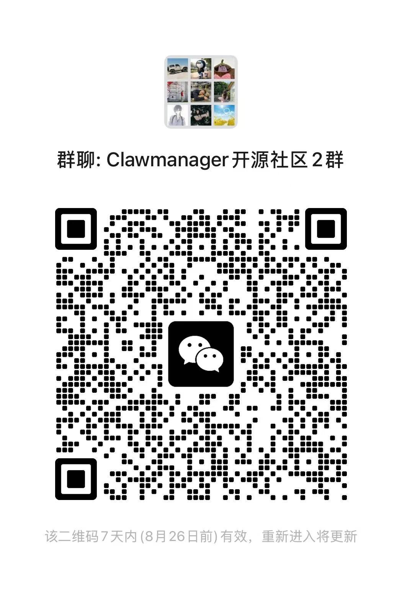
        
      <strong>WeChat</strong>
       
      QR 코드를 스캔하여 WeChat 그룹에 참여
    </td>
    <td align="center" width="320" valign="top">
      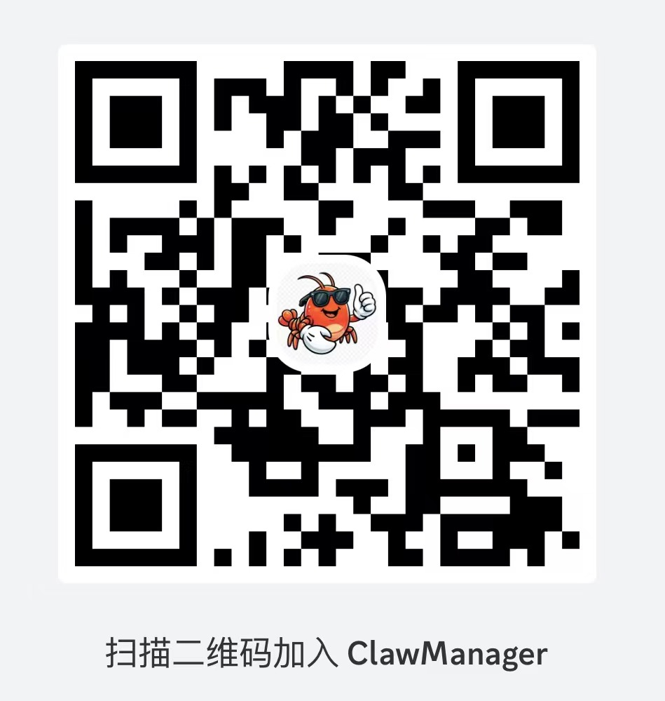
        
      <strong>Discord</strong>
       
      <a href="https://discord.gg/9RwgbGJD5R">QR 코드를 스캔하여 Discord 서버에 참여</a>
    </td>
  </tr>
</table>

## 제품 소개

ClawManager는 관리형 Runtime, Team 협업, 모델 접근, 리소스와 Skill Hub, 플랫폼 보안을 하나의 Kubernetes 네이티브 제품으로 제공합니다.

다음과 같은 팀에 적합합니다.

- 여러 사용자를 대상으로 AI Agent 인스턴스를 운영하는 플랫폼 팀
- 런타임 가시성, 명령 배포, desired state 제어가 필요한 운영 팀
- 수동 설정 대신 재사용 가능한 리소스로 Agent 워크스페이스를 제공하고 싶은 개발 팀

## Runtime 연동

ClawManager는 현재 다음 관리형 Runtime을 지원합니다.

-  `OpenClaw`: Lite/Pro, 네이티브 대화, 도구, 예약 작업, Team 지원
-  `Hermes`: Lite/Pro, 영구 `.hermes`, 네이티브 세션, Team Worker 지원
-  `OpenCode`: AI Gateway, 데스크톱/터미널, 파일을 제공하는 관리형 코딩 워크스페이스. [OpenCode Workspace Guide](./docs/opencode-lite-pro-agent-development_ko.md)
-  `DeepSeek Harness`: Lite 공유 Pool 및 Pro 전용 Desktop, AI Gateway 모델 주입, Skill, Workspace File, 격리 Browser Access 지원

Runtime 미리보기:

** OpenClaw**

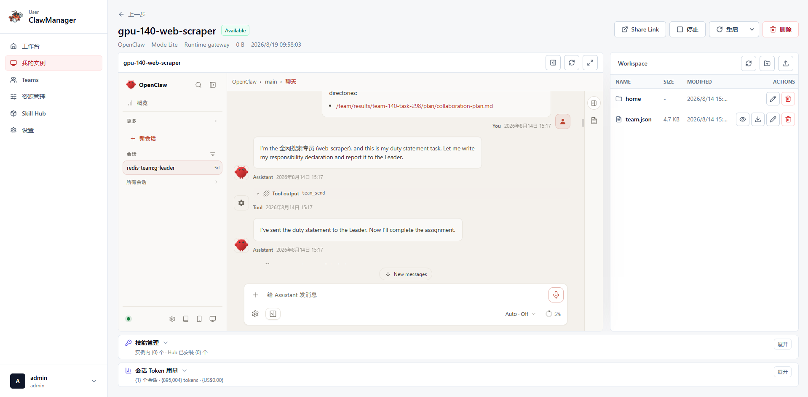

** Hermes**

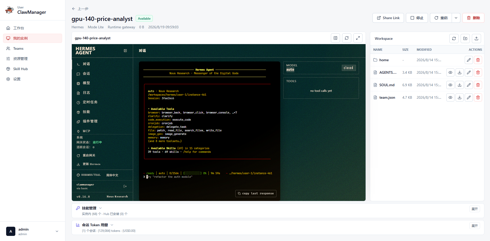

** OpenCode**

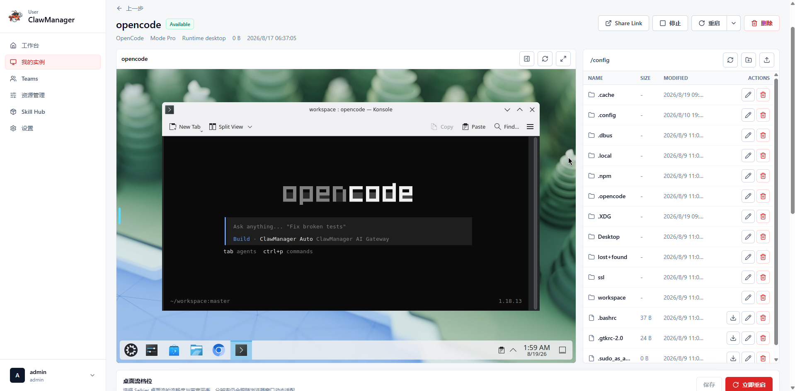

** DeepSeek Harness**

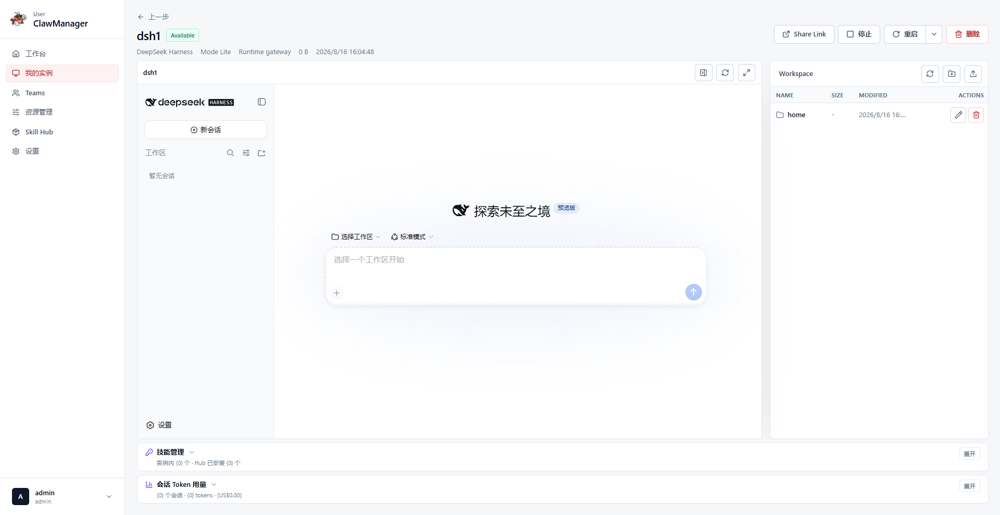

## 시작하기

먼저 `k3s` 또는 `k8s`를 선택한 다음 단일 노드 또는 클러스터 스토리지 구성을 선택합니다.

- k3s 단일 노드 / HostPath: [Manifest](./deployments/k3s/single-node/clawmanager.yaml)
- k3s 클러스터 / CSI-RWX: [Manifest](./deployments/k3s/cluster/clawmanager.yaml)
- Kubernetes 단일 노드 / HostPath: [Manifest](./deployments/k8s/single-node/clawmanager.yaml)
- Kubernetes 클러스터 / CSI-RWX: [Manifest](./deployments/k8s/cluster/clawmanager.yaml)
- 첫 로그인 및 기본 사용 흐름: [사용자 가이드](./docs/use_guide_ko.md)
- 배포 설명 및 아키텍처 배경: [Deployment Guide](./docs/deployment_ko.md)

## 핵심 플랫폼 기능

### Runtime 및 인스턴스 관리

OpenClaw, Hermes, OpenCode, DeepSeek Harness를 Lite/Pro로 만들고 이미지, 리소스, 수명주기, 데스크톱, 파일, Shell, 환경 변수, 아카이브, Share Link, Lite 일괄 작업을 관리합니다.

### AI Gateway

AI Gateway는 Models, AI Audit, Costs, Session Usage, Risk Rules의 다섯 영역을 제공합니다. Chat Completions, OpenAI Responses, Anthropic Messages와 지원 모델의 관리형 Thinking을 처리합니다.

- 모델 트래픽을 위한 통합 진입점
- 보안 모델 라우팅과 정책 기반 모델 선택
- 엔드투엔드 감사 및 추적 기록
- 내장된 비용 계산과 사용량 분석
- 차단 또는 라우팅 전환이 가능한 리스크 제어 규칙

[AI Gateway Guide](./docs/aigateway_ko.md)를 참고하세요.

### Agent Control Plane

Agent Control Plane은 관리되는 AI Agent 인스턴스를 위한 런타임 오케스트레이션 계층입니다. 각 인스턴스를 등록, 상태 보고, 명령 수신, 그리고 플랫폼 측 desired state와의 정렬이 가능한 관리형 런타임으로 만듭니다.

- 보안 부트스트랩과 세션 라이프사이클 기반 Agent 등록
- 하트비트 기반 런타임 상태 및 헬스 리포팅
- 컨트롤 플레인과 인스턴스 간 desired state 동기화
- 시작, 중지, 설정 적용, 헬스체크, Skill 작업을 위한 명령 배포
- 인스턴스 단위의 Agent 상태, channel, skill, 명령 이력 가시화

Lifecycle, Status, Restart, Runtime Health, 관리자 작업은 [사용자 매뉴얼](./docs/use_guide_ko.md#operate-an-instance)을 참고하세요.

### 리소스 관리

리소스 관리는 리소스, 리소스 팩, 주입 기록의 세 탭으로 구성된 사용자용 OpenClaw 설정 센터입니다. 관리자 Security Protection과는 독립적입니다.

- Channel Template, Form/JSON 편집, 복제, Lifecycle 관리
- Skill ZIP Import, 충돌 처리, Download, 삭제. Skill Hub는 Catalog, Version, Publish, Install을 담당
- Scheduled Task의 간단/고급 편집. Agent Resource는 표시되지만 현재 이 화면에서는 구성할 수 없음
- Resource Pack 생성, 편집, 복제 및 인스턴스 생성 시 재사용
- 전달 Mode, Resource, 환경 변수, Status, 생성 시각을 보여 주는 읽기 전용 Injection Record

[Resource Management Guide](./docs/resource-management_ko.md)와 [Skill Hub Guide](./docs/skill-hub-guide_ko.md)를 참고하세요.

### Team 협업

Team은 Leader 중개형 Flow입니다. 변경할 수 없는 Built-in Template 8개 또는 User Custom Template으로 만들며, OpenClaw Lite Leader가 계획, Task 분해, Dispatch, Member Delivery 검증, 최종 결과 게시를 담당합니다.

- Team마다 OpenClaw Lite Leader 1명, Worker는 OpenClaw Lite 또는 Hermes Lite
- Custom Team은 자연어 생성, Role별 조정, 전체 재생성, 재사용 지원
- Team Chat은 Plan, Assignment, Progress, Review, Delivery, Final Synthesis 기록
- Execution Kanban은 Current Query, Task Breakdown, Delivery State 표시
- Shared File/Artifact를 보관하고 Hermes Lite Native Team Session은 Instance View에서 확인

생성 과정, 협업 단계, 결과 확인은 [Team Workspace Quick Guide](./docs/team-workspaces-guide_ko.md)를 참고하세요.

### Security Protection Platform

Security Protection은 네 개의 Live 지표, Security Event, Pod Live Aegis Configuration, Report Export, Emergency Circuit Breaker를 제공하는 독립 Admin Workspace입니다. Overview는 현재 KSecure를 7 Risk Surface, 15 Scenario, 4 Layer로 표시하며 Runtime 방어, Host/Container 격리, Component Trust, Identity/Outbound, Policy, Collaboration, Quota, Approval, Skill Scanner, Full-chain Audit으로 이동합니다.

[Security Platform Guide](./docs/security-platform_ko.md)를 참고하세요.

## 제품 갤러리

ClawManager는 관리, 접근, AI 거버넌스를 서로 분리된 도구로 다루지 않고, 하나의 일관된 제품 경험으로 묶도록 설계되었습니다.

### Lite 모드 배포

Lite 모드는 OpenClaw, Hermes, OpenCode, DeepSeek Harness 인스턴스를 공유 gateway runtime pool을 통해 프로비저닝합니다. 각 워크스페이스는 관리되는 runtime Pod 안의 독립 gateway 프로세스로 실행되어 빠르게 시작되고 전용 CPU, 메모리, 스토리지, GPU 할당 부담을 줄이면서도 워크스페이스 접근, Share Link / Password 접근, 지원되는 channel 및 skill 주입, 관리자 가시성을 유지합니다.

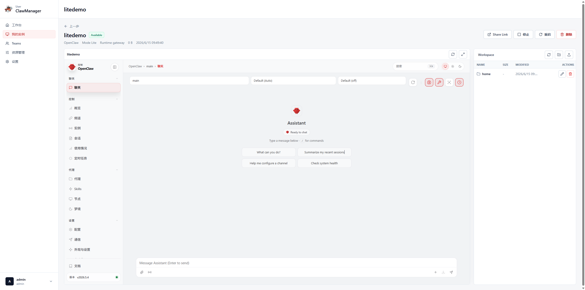

### Pro 모드 배포

Pro 모드는 각 인스턴스에 전용 desktop runtime을 프로비저닝하며, 독립 Kubernetes Deployment, Service, PVC로 구성됩니다. 더 강한 격리, 전체 데스크톱 리소스, runtime events, 인스턴스 skill 관리, 완전한 데스크톱 관리 경험이 필요한 경우에 적합합니다.

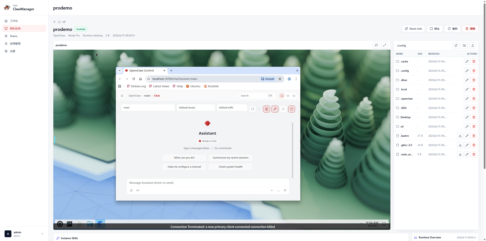

### Team 워크스페이스

Team 워크스페이스는 왼쪽에 대화와 산출물, 오른쪽에 현재 질의, 작업 분해, 상태, 산출물 상세를 표시합니다.

  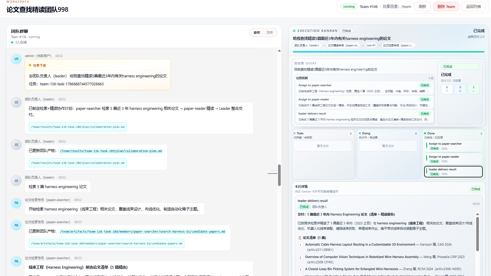

### 리소스 관리

Channel, Skill, Scheduled Task, Resource Pack, Injection Record를 하나의 사용자 화면에서 관리하며 Security Protection은 별도 관리자 기능으로 유지됩니다.

  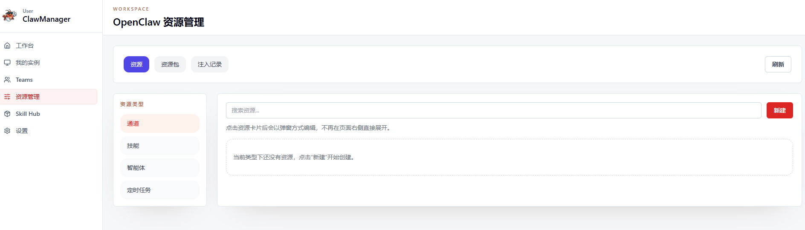

### Security Protection

전용 관리자 화면에서 Live 지표와 Event, KSecure Layer, Pod Aegis, Report Export, Emergency Circuit Breaker를 관리합니다.

  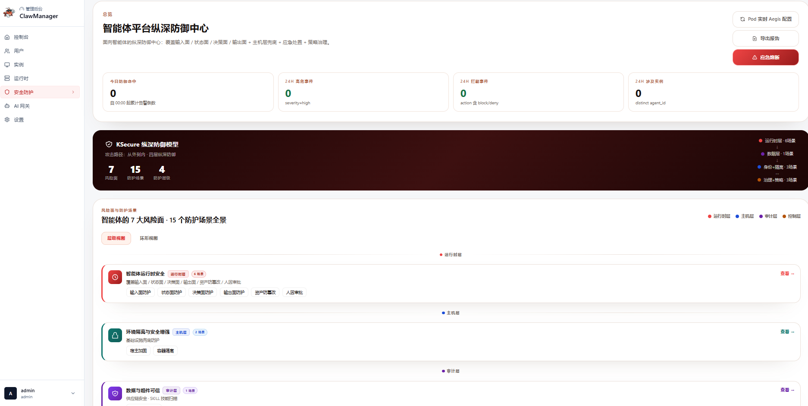

### 관리 콘솔

관리 콘솔은 사용자, 쿼터, 런타임 작업, 보안 제어, 플랫폼 수준 정책을 하나의 화면으로 묶습니다. 대규모 AI Agent 인프라를 운영하는 팀의 핵심 작업 공간입니다.

  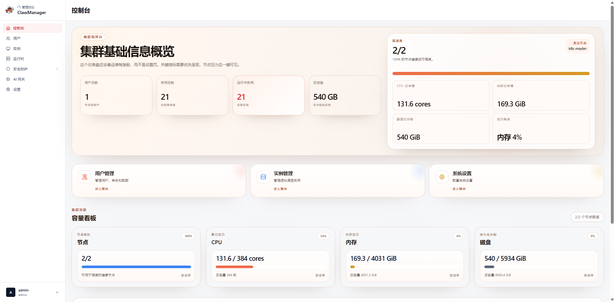

### Portal Access

Portal은 사용자에게 일관된 워크스페이스 진입점을 제공합니다. 브라우저 기반으로 접근하면서도 컨트롤 플레인과 동기화된 런타임 상태를 확인할 수 있어, 사용자가 인프라 세부 사항을 직접 다루지 않아도 됩니다.

  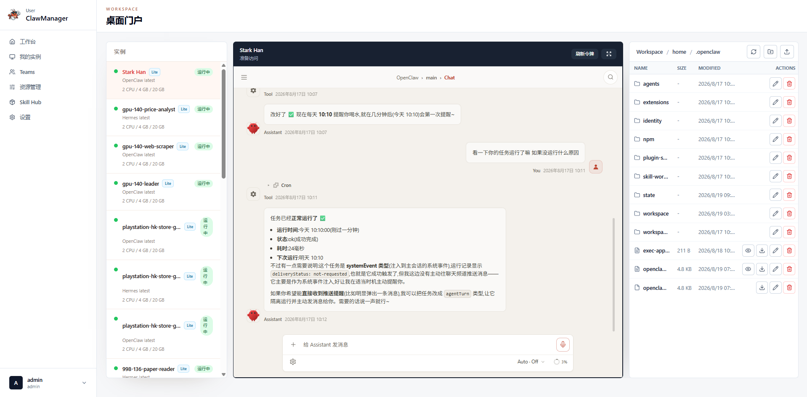

### AI Gateway

AI Gateway는 모델 사용 거버넌스를 워크스페이스 경험 자체에 통합합니다. 감사 로그, 비용 가시성, 리스크 라우팅을 제공하여 AI 사용을 개별 통합이 아닌 플랫폼 기능으로 다룰 수 있게 합니다.

  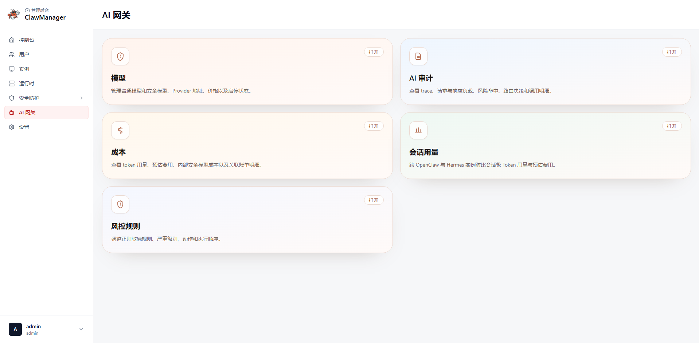

## 동작 방식

1. 관리자가 거버넌스 정책과 재사용 가능한 리소스를 정의합니다.
2. 사용자가 Kubernetes에서 관리되는 AI Agent 워크스페이스를 생성하거나 진입합니다.
3. Team 워크스페이스는 여러 멤버 Runtime을 Redis Team Bus와 공유 스토리지 설정과 함께 프로비저닝할 수 있습니다.
4. Agent가 컨트롤 플레인에 연결해 런타임 상태를 보고합니다.
5. Channel, skill, bundle이 컴파일되어 인스턴스에 적용됩니다.
6. AI 트래픽은 AI Gateway를 통해 전달되며, 감사, 리스크, 비용 제어가 함께 적용됩니다.

## 개발자 개요

ClawManager는 React 프런트엔드, Go 백엔드, 상태 저장용 MySQL, 그리고 `skill-scanner` 및 오브젝트 스토리지 통합을 포함한 Kubernetes 네이티브 플랫폼입니다. 코드베이스는 제품 서브시스템 단위로 구성되어 있으므로, 관련 가이드에서 시작한 뒤 코드로 들어가는 방식이 가장 효율적입니다.

- 프런트엔드의 관리자 및 사용자 화면은 `frontend/`
- 백엔드 서비스, handler, repository, migration은 `backend/`
- 배포 자산은 `deployments/`
- 제품 문서와 이미지 자산은 `docs/`

Runtime과 Protocol 기술 자료는 Contributor를 위해 `docs/`에 유지하고, 아래 사용자 문서는 제품 Workflow 중심으로 정리합니다.

## 문서

- [사용자 가이드](./docs/use_guide_ko.md)
- [Team Workspace Quick Guide](./docs/team-workspaces-guide_ko.md)
- [Deployment Guide](./docs/deployment_ko.md)
- [AI Gateway Guide](./docs/aigateway_ko.md)
- [Security Platform Guide](./docs/security-platform_ko.md)
- [Resource Management Guide](./docs/resource-management_ko.md)
- [Skill Hub Guide](./docs/skill-hub-guide_ko.md)
- [OpenCode Workspace Guide](./docs/opencode-lite-pro-agent-development_ko.md)

## 라이선스

이 프로젝트는 MIT License로 공개됩니다.

## 오픈소스

Issue와 Pull Request를 환영합니다.

## Star History

<a href="https://github.com/Yuan-lab-LLM/ClawManager/actions/workflows/update-star-history.yml">
 <picture>
   <source media="(prefers-color-scheme: dark)" srcset="https://raw.githubusercontent.com/Yuan-lab-LLM/ClawManager/star-history/star-history-dark.svg" />
   <source media="(prefers-color-scheme: light)" srcset="https://raw.githubusercontent.com/Yuan-lab-LLM/ClawManager/star-history/star-history-light.svg" />
   
 </picture>
</a>
