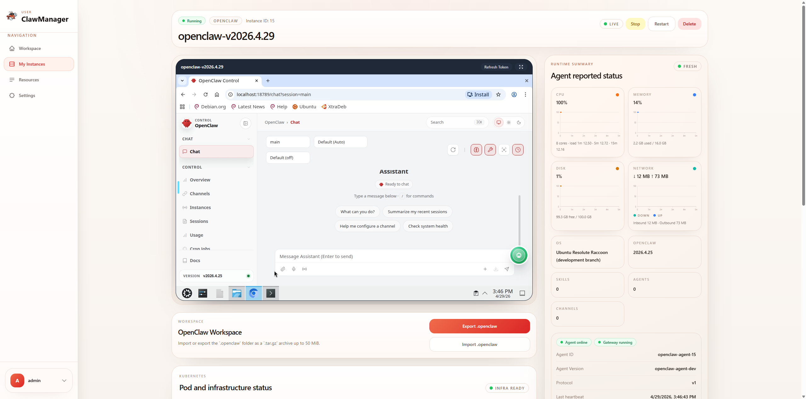
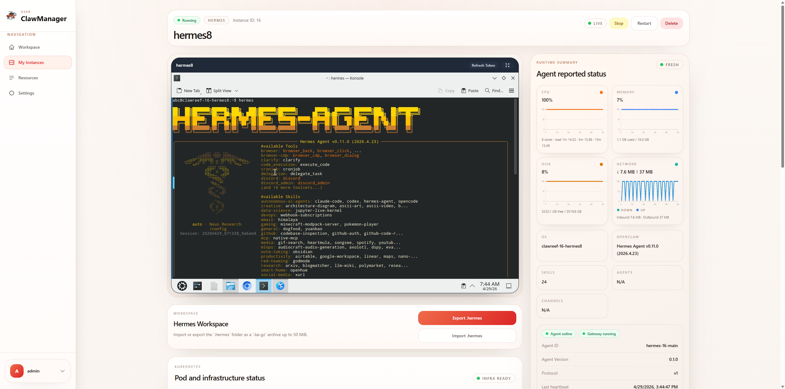
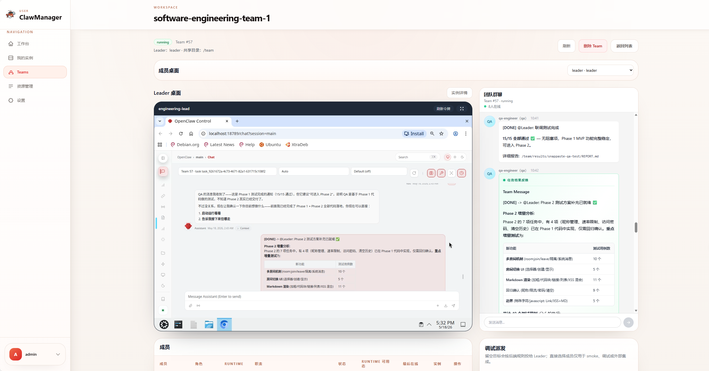

# ClawManager

  

  一个面向 AI Agent 实例管理的 Kubernetes 原生控制平面，提供受治理的 AI 访问、运行时编排，以及适用于多种 Agent Runtime 的可复用资源管理能力。

  <strong>语言:</strong>
  <a href="./README.md">English</a> |
  简体中文 |
  <a href="./README.ja.md">日本語</a> |
  <a href="./README.ko.md">한국어</a> |
  <a href="./README.de.md">Deutsch</a>

  
  
  
  
  

  <a href="#product-tour">了解产品</a> |
  <a href="#team-workspaces">Team 协作</a> |
  <a href="#ai-gateway">AI Gateway</a> |
  <a href="#agent-control-plane">Agent Control Plane</a> |
  <a href="#runtime-integrations">Runtime 接入</a> |
  <a href="#resource-management">资源管理</a> |
  <a href="#get-started">快速开始</a>

  

<h2 align="center">60 秒认识 ClawManager</h2>

  快速了解 Agent 实例创建、Skill 管理与扫描，以及 AI Gateway 治理能力。

## 最新动态

这里展示最近的重要产品与文档更新。

- [2026-05-18] 新增 Team 工作空间 MVP 介绍与界面预览，覆盖一键创建 Team、OpenClaw 成员编排、Redis Team Bus 配置注入、共享存储、成员状态、任务派发，以及事件和结果查看。
- [2026-04-29] 新增 Hermes Runtime 接入支持，覆盖基于 Webtop 的实例创建、Agent Control Plane 注册、AI Gateway 注入、channel 与 skill 引导注入，以及 `.hermes` 导入导出流程。见 [Hermes Runtime Guide](./docs/hermes-runtime-agent-development.md)。
- [2026-04-08] 平台新增了 Skill 管理与 Skill 扫描工作流，见 [Merged PR #52](https://github.com/Yuan-lab-LLM/ClawManager/pull/52)。
- [2026-03-26] AI Gateway 文档已更新，补充了模型治理、审计追踪、成本核算与风险控制能力，见 [AI Gateway Guide](./docs/aigateway.md)。
- [2026-03-20] ClawManager 进一步演进为面向 AI Agent 工作空间的控制平面，强化了运行时控制、可复用资源与安全扫描工作流。

> 如果 ClawManager 对你的团队有帮助，欢迎为项目点一个 Star，帮助更多用户和开发者发现它。

  

## 社区微信群

欢迎加入 ClawManager 开源社区微信群，获取产品更新、交流使用经验，并与贡献者一起讨论共建。

  

## 产品介绍

ClawManager 将 AI Agent 实例的运行、治理与运维能力带到 Kubernetes，并在运行时基础之上叠加三层更高阶的控制平面。团队可以用它治理 AI 访问、通过 Agent 编排运行时行为，并通过可扫描、可复用的 channel 与 skill 资源交付工作空间能力。

它适合以下场景：

- 面向多用户运行 AI Agent 实例的平台团队
- 需要运行时可观测性、命令下发与期望态控制的运维团队
- 希望以可复用资源而不是手工配置方式交付 Agent 工作空间的开发团队

## Team 工作空间

Team 工作空间让 ClawManager 从单实例运维扩展到多 Agent 协作编排。用户可以创建一个 Team，指定一个 Leader 和多个成员，由 ClawManager 负责创建成员 Runtime、注入协作配置，并在控制面持续展示任务、事件和结果状态。

当前 MVP 聚焦 OpenClaw 成员编排与 Redis Team Bus 闭环：

- 一键创建 Team，并校验 Leader / 成员 roster
- 为成员 Runtime Pod 注入 Team 角色、成员 ID、控制面地址和共享目录配置
- 通过受控环境变量和 Secret 引用注入 Redis inbox、events、presence 与 DLQ key
- 将共享 PVC 挂载到 `/team`，用于上下文、产物、快照和任务结果
- Team 详情页集中展示 Leader 桌面、团队群聊、成员列表、调试派发、任务进度与事件结果
- Team、成员、任务和事件以 DB 为权威状态，Redis 仅作为消息总线与短期 presence 通道

## Runtime 接入

ClawManager 当前支持以下受管 Runtime：

-  `OpenClaw`：ClawManager 默认支持的 OpenClaw 风格桌面工作空间 Runtime
-  `Hermes`：基于 Webtop 的 Runtime 接入，带有持久化 `.hermes` 工作空间和内置 Hermes agent

Runtime 预览：

** OpenClaw**

** Hermes**

Runtime 开发方可以参考 [Hermes Runtime Guide](./docs/hermes-runtime-agent-development.md)、[通用 Runtime Agent 接入指南](./docs/runtime-agent-integration-guide.md) 与 [Skill Content MD5 规范](./docs/skill-content-md5-spec.md) 实现兼容 agent。

## 快速开始

ClawManager 现在同时提供标准 Kubernetes 与轻量级集群的清晰入口。如果你想快速评估产品，可以先从匹配你环境的部署路径开始，再进入首次登录与上手流程。

- 标准 Kubernetes 部署: [deployments/k8s/clawmanager.yaml](./deployments/k8s/clawmanager.yaml)
- K3s / 轻量集群部署: [deployments/k3s/clawmanager.yaml](./deployments/k3s/clawmanager.yaml)
- 首次登录与操作流程: [用户指南](./docs/use_guide_cn.md)
- 部署说明与架构背景: [Deployment Guide（英文）](./docs/deployment.md)

## 三大控制平面

### AI Gateway

AI Gateway 是 ClawManager 中负责模型访问治理的控制平面。它为受管 Agent Runtime 提供统一的 OpenAI 兼容入口，同时在上游模型服务之上叠加策略、审计与成本控制能力。

- 统一的模型访问入口
- 安全模型路由与策略驱动的模型选择
- 端到端审计与追踪记录
- 内建成本核算与使用分析
- 可阻断或改道路由的风险控制规则

参见 [AI Gateway Guide（英文）](./docs/aigateway.md)。

### Agent Control Plane

Agent Control Plane 是受管 AI Agent 实例的运行时编排层。它让每一个实例都成为可注册、可汇报状态、可接收命令，并持续对齐平台期望态的受管运行时。

- 基于安全引导与会话生命周期的 Agent 注册
- 依靠心跳机制进行运行时状态与健康上报
- 控制平面与实例之间的期望态同步
- 支持启动、停止、配置应用、健康检查与 Skill 操作的命令下发
- 在实例维度查看 Agent 状态、channel、skill 与命令历史

参见 [Agent Control Plane Guide（英文）](./docs/agent-control-plane.md)。

### 资源管理

资源管理是 AI Agent 工作空间的可复用资产层。团队可以先准备好 channel 和 skill，再通过 bundle 进行组合、注入到实例中，并把安全审查纳入整个交付流程。

- `Channel` 管理，用于工作空间连接与集成模板
- `Skill` 管理，用于可复用能力包
- `Skill Scanner` 工作流，用于风险审查与扫描任务
- 基于 bundle 的资源组合，用于可重复交付
- 通过注入快照追踪实际下发到实例的内容

参见 [Resource Management Guide（英文）](./docs/resource-management.md) 与 [Security / Skill Scanner Guide（英文）](./docs/security-skill-scanner.md)。

## 产品界面

ClawManager 的设计目标，是让管理、访问与 AI 治理体验形成统一的产品界面，而不是分散在多个孤立工具中。

### Team 工作空间

Team 工作空间页面把 Leader 桌面、团队群聊、成员表格和调试派发流程集中在同一个操作视图中，用户可以直接观察协作进度、成员反馈和任务结果。

  

### 管理控制台

管理控制台将用户、配额、运行时操作、安全控制与平台级策略集中到一起，是团队管理 AI Agent 基础设施的核心工作台。

  

### Portal 访问

Portal 为用户提供统一的工作空间入口。用户可以通过浏览器访问实例，并查看与控制平面保持一致的运行时状态，而不需要直接面对底层基础设施细节。

  

### AI Gateway

AI Gateway 将模型访问治理纳入工作空间体验本身，提供审计记录、成本可见性与风险路由能力，让 AI 使用成为平台能力的一部分，而不是零散接入。

  

## 工作方式

1. 管理员先定义治理策略与可复用资源。
2. 用户在 Kubernetes 上创建或进入受管 AI Agent 工作空间。
3. Team 工作空间可以一次编排多个成员 Runtime，并注入 Redis Team Bus 与共享存储配置。
4. Agent 回连控制平面并上报运行时状态。
5. Channel、skill 与 bundle 被编译并应用到实例中。
6. AI 流量通过 AI Gateway 进入上游服务，并附带审计、风险与成本控制。

## 开发者概览

ClawManager 是一个 Kubernetes 原生平台，包含 React 前端、Go 后端、MySQL 状态存储，以及 `skill-scanner` 与对象存储等支撑组件。代码库按产品子系统组织，因此更适合从对应能力的指南切入，再进入代码实现。

- 前端管理界面与用户界面位于 `frontend/`
- 后端服务、handler、repository 与 migration 位于 `backend/`
- 部署资产位于 `deployments/`
- 产品文档与素材位于 `docs/`

参见 [Developer Guide（英文）](./docs/developer-guide.md)。

## 文档

- [用户指南](./docs/use_guide_cn.md)
- [Deployment Guide（英文）](./docs/deployment.md)
- [Admin and User Guide（英文）](./docs/admin-user-guide.md)
- [Agent Control Plane Guide（英文）](./docs/agent-control-plane.md)
- [AI Gateway Guide（英文）](./docs/aigateway.md)
- [Security / Skill Scanner Guide（英文）](./docs/security-skill-scanner.md)
- [Resource Management Guide（英文）](./docs/resource-management.md)
- [Hermes Runtime Guide](./docs/hermes-runtime-agent-development.md)
- [通用 Runtime Agent 接入指南](./docs/runtime-agent-integration-guide.md)
- [Skill Content MD5 规范](./docs/skill-content-md5-spec.md)
- [Developer Guide（英文）](./docs/developer-guide.md)

## 许可证

本项目基于 MIT License 开源。

## 开源协作

欢迎提交 Issue 与 Pull Request。

## Star History

<a href="https://www.star-history.com/?repos=Yuan-lab-LLM%2FClawManager&type=date&legend=top-left">
 <picture>
   <source media="(prefers-color-scheme: dark)" srcset="https://api.star-history.com/chart?repos=Yuan-lab-LLM/ClawManager&type=date&theme=dark&legend=top-left" />
   <source media="(prefers-color-scheme: light)" srcset="https://api.star-history.com/chart?repos=Yuan-lab-LLM/ClawManager&type=date&legend=top-left" />
   
 </picture>
</a>
