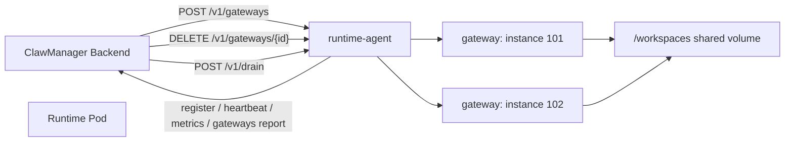

# Agent Runtime 开发规范

本文是 ClawManager 托管 runtime 的 agent 侧开发规范，适用于 OpenClaw、Hermes，以及后续新增的任意 runtime。开发新 runtime 时，应先满足本文的通用要求，再补充 runtime 自己的启动命令、配置文件和健康检查细节。

相关协议和背景请同时参考：

- `docs/clawmanager-agent-v2-development-guide.md`
- `docs/clawmanager-agent-v2-contract.md`
- `docs/runtime-agent-integration-guide.md`
- `docs/hermes-lite-pro-agent-development.md`
- `docs/hermes-runtime-agent-development.md`

## 1. 范围和目标

一个托管 runtime 镜像不能只启动业务进程。它必须内置一个常驻 runtime agent，由 agent 在 Pod 内负责：

- Runtime Pod 注册、heartbeat、metrics、gateway 状态上报。
- 接收 ClawManager 下发的 create、delete、drain、restart 等控制指令。
- 管理本 Pod 内多个 gateway 子进程。
- 管理端口池、进程、workspace、UID/GID、资源限制和健康检查。
- 把 ClawManager 注入的 AI Gateway、实例 token、代理信任和 runtime 配置写入每个实例自己的 workspace。

一句话原则：agent 是 Pod 内 gateway 管理器，不是同步启动脚本。

## 2. 架构约束

每个 Runtime Pod 内只能有一个 runtime agent 控制进程。一个用户实例对应一个 gateway 子进程和一个 workspace。



浏览器只访问 ClawManager 的 HTTPS 入口。ClawManager 再反代到 Pod 内部 gateway。runtime agent 不应把每个 gateway 的自签 HTTPS 地址直接暴露给前端。

## 3. 必须遵守的原则

| 原则 | 要求 |
| --- | --- |
| 异步创建 | `POST /v1/gateways` 必须快速返回，通常 1 到 3 秒内返回 `status=starting`，不能阻塞等待业务 gateway 完全启动。 |
| 幂等创建 | 以 `instance_id + generation` 为主要幂等键，重复请求必须返回同一个 gateway 元数据，不能重复启动进程。 |
| 状态以真实进程为准 | `running` 只能在进程存在且健康检查通过时上报，不能只读旧缓存。 |
| 端口统一管理 | 端口由 agent 本地分配器加锁分配，启动前检查监听占用，停止后释放。 |
| 配置按 workspace 隔离 | 每个实例的 runtime 配置写入自己的 workspace，不能写全局配置。 |
| 不覆盖用户配置 | 修改 runtime 配置必须做 JSON merge，保留已有字段，数组 append 后去重。 |
| 不写死环境地址 | 不写死外部 IP、域名、CIDR，必须从 env 或 ClawManager 请求中读取。 |
| 内部服务优先 | runtime 内部访问 ClawManager 使用 Kubernetes Service DNS，不使用浏览器访问的外部地址。 |
| 时间必须可信 | token、设备签名、JWT 和 WebSocket 校验依赖时间，agent 必须检测时钟偏移，不能在明显偏移时报告健康。 |
| 安全默认开启 | 控制接口校验 token，路径校验不能越权，命令执行不能拼 shell 字符串。 |

## 4. Runtime Pod 环境变量

agent 至少支持以下环境变量：

| 变量 | 说明 |
| --- | --- |
| `CLAWMANAGER_RUNTIME_TYPE` | runtime 类型，例如 `openclaw`、`hermes`。 |
| `RUNTIME_WORKSPACE_ROOT` | workspace 根目录，默认 `/workspaces`。 |
| `RUNTIME_GATEWAY_PORT_START` | gateway 端口起始值，默认 `20000`。 |
| `RUNTIME_GATEWAY_PORT_END` | gateway 端口结束值，默认 `20099`。 |
| `RUNTIME_AGENT_CONTROL_TOKEN` | ClawManager 调 agent 控制接口使用。 |
| `RUNTIME_AGENT_REPORT_TOKEN` | agent 上报 ClawManager 使用。 |
| `CLAWMANAGER_BACKEND_URL` | ClawManager backend 内部地址，推荐 `http://clawmanager-gateway.clawmanager-system.svc.cluster.local:9001`。 |
| `RUNTIME_AGENT_LISTEN_ADDR` | agent 控制接口监听地址，默认 `0.0.0.0:19090`。 |
| `RUNTIME_AGENT_PUBLIC_PORT` | 注册给 ClawManager 的 agent 端口，默认 `19090`。 |
| `CLAWMANAGER_RUNTIME_IMAGE_REF` | 当前 runtime 镜像标识。 |
| `POD_NAME` / `POD_NAMESPACE` / `POD_IP` / `NODE_NAME` | 通过 Downward API 注入的 Pod 身份。 |
| `CLAWMANAGER_TRUSTED_PROXY_CIDRS` | ClawManager app 或 gateway Pod 的来源网段，供 runtime 的 trusted proxy 配置使用。 |
| `CLAWMANAGER_CONTROL_UI_ORIGIN` | ClawManager 内部 Control UI origin，默认可由 `CLAWMANAGER_BACKEND_URL` 推导。 |

要求：

- `CLAWMANAGER_BACKEND_URL` 必须是内部服务地址，不能使用 `https://172.16.1.12:39443` 这类浏览器外部入口。
- 只有对浏览器生成页面 URL 时才使用外部入口。runtime gateway 的信任来源和 LLM base URL 都应使用内部服务 DNS。
- agent 启动时要校验必填 env，缺失时上报 `unhealthy`，并在 `/v1/health` 返回 503。

## 5. Gateway 创建协议

ClawManager 调用：

```http
POST /v1/gateways
X-ClawManager-Control-Token: ${RUNTIME_AGENT_CONTROL_TOKEN}
Content-Type: application/json
```

请求字段以 `docs/clawmanager-agent-v2-contract.md` 为准，当前应支持：

```json
{
  "instance_id": 123,
  "user_id": 45,
  "agent_type": "hermes",
  "workspace_path": "/workspaces/hermes/user-45/instance-123",
  "port_range": {
    "start": 20000,
    "end": 20099
  },
  "uid": 200123,
  "gid": 200123,
  "cpu_cores": 2,
  "memory_mb": 4096,
  "disk_quota_mb": 20480,
  "generation": 7,
  "environment": {
    "CLAWMANAGER_LLM_BASE_URL": "http://clawmanager-gateway.clawmanager-system.svc.cluster.local:9001/api/v1/gateway/llm",
    "CLAWMANAGER_LLM_API_KEY": "instance-token",
    "CLAWMANAGER_LLM_MODEL": "[\"auto\"]",
    "CLAWMANAGER_LLM_PROVIDER": "openai-compatible",
    "CLAWMANAGER_INSTANCE_TOKEN": "instance-token",
    "OPENAI_API_KEY": "instance-token"
  }
}
```

成功响应必须快速返回：

```json
{
  "gateway_id": "gw-123-7",
  "instance_id": 123,
  "port": 20017,
  "pid": null,
  "status": "starting",
  "workspace_path": "/workspaces/hermes/user-45/instance-123"
}
```

创建流程：

1. 校验控制 token、`agent_type`、`instance_id`、`user_id`、`generation`、`workspace_path`、端口范围。
2. 检查当前 Pod 是否 draining。draining 时返回 409 或 503。
3. 按 `instance_id + generation` 查询本地状态。已存在 `starting` 或 `running` 时直接返回已有元数据。
4. 若收到更高 generation，停止并释放同实例旧 generation gateway。
5. 加锁分配端口，先标记 reserved。
6. 创建 workspace 和 home 目录，设置 owner 为请求中的 `uid/gid`。
7. 写入或合并 runtime 配置。
8. 记录 gateway 元数据为 `starting`。
9. 后台启动进程，立即返回。
10. 后台健康检查通过后，上报 `/api/v1/runtime-agent/gateways/report`，状态为 `running`。
11. 启动失败或健康检查失败时，上报 `error`，释放端口，并保留错误信息。

禁止事项：

- 禁止在 HTTP handler 里直接运行前台命令并等待它退出。
- 禁止同一个 create 请求触发多个 gateway 进程。
- 禁止把请求里的任意字符串拼接成 shell 命令。
- 禁止创建不在端口范围内的监听端口。

## 6. 端口和资源管理

agent 必须实现并发安全的端口分配器：

```text
reserve(instance_id, generation, count) -> port_set
commit(instance_id, generation, port_set)
release(instance_id, generation)
list_used()
```

要求：

- 分配时持有互斥锁。
- 在锁内检查 agent 内存状态和系统监听端口。
- runtime 如果需要主端口、control 端口、browser 端口或 sidecar 端口，必须一次分配一组端口。
- 启动失败、健康检查失败、DELETE 成功后必须释放端口。
- `used_slots` 来自真实 `starting` 和健康 `running` gateway 数量，不能来自旧缓存。

资源隔离要求：

- 每个 gateway 使用独立进程组。
- 业务进程最终以请求里的 `uid/gid` 运行。
- CPU、Memory 使用 cgroup 限制。
- Disk 使用 filesystem quota 或周期扫描加错误上报。
- 删除 gateway 不删除 workspace。

## 7. Workspace 和配置写入

workspace 固定格式：

```text
/workspaces/{runtime}/user-{user_id}/instance-{instance_id}
```

agent 必须：

- 对 workspace root 和请求路径执行 realpath。
- 拒绝 `..`、符号链接逃逸、跨用户或跨实例路径。
- 创建 `${workspace}/home`，并设置 `HOME=${workspace}/home`。
- 密钥、token、provider 配置文件权限建议 `0600`。
- owner 设置为该 gateway 的 `uid/gid`。

runtime 配置必须写在 workspace 内。例如：

| Runtime | 推荐配置路径 |
| --- | --- |
| OpenClaw | `{workspace}/home/.openclaw/openclaw.json` |
| Hermes | `{workspace}/home/.hermes/hermes.json` 或 Hermes 原生配置路径 |

JSON merge 规则：

- 对象字段递归 merge。
- 已存在字段默认保留。
- 平台必须控制的字段可以覆盖，但要在代码中显式列出。
- 数组字段 append 后去重，例如 `allowedOrigins`。
- 不删除用户已有的未知字段。
- 写入前先生成临时文件，再原子 rename。

## 8. AI Gateway 和模型凭证注入

ClawManager 会在 `POST /v1/gateways` 的 `environment` 字段中下发实例级 LLM 环境变量。agent 必须把这些变量传给 gateway 子进程，并按 runtime 需要写入配置文件。

允许转发给子进程的变量应使用白名单：

```text
CLAWMANAGER_LLM_BASE_URL
CLAWMANAGER_LLM_API_KEY
CLAWMANAGER_LLM_MODEL
CLAWMANAGER_LLM_PROVIDER
CLAWMANAGER_INSTANCE_TOKEN
OPENAI_BASE_URL
OPENAI_API_BASE
OPENAI_API_KEY
OPENAI_MODEL
```

要求：

- `CLAWMANAGER_LLM_BASE_URL` 使用 ClawManager 内部服务 DNS。
- `CLAWMANAGER_LLM_API_KEY` 和 `OPENAI_API_KEY` 使用当前实例 token。
- 不能要求用户在 runtime 页面手工填写 OpenAI key。
- 不能把 API key、实例 token、bootstrap token 打到日志。
- 如果 `environment` 里缺少 API key，agent 不应报告 gateway `running`，应上报 `error`，错误消息明确说明缺少实例 LLM token。

Hermes 落地时应把上述 env 转换成 Hermes 的 provider 配置，推荐语义：

```json
{
  "models": {
    "providers": {
      "auto": {
        "type": "openai-compatible",
        "baseUrl": "${CLAWMANAGER_LLM_BASE_URL}",
        "apiKey": "${CLAWMANAGER_LLM_API_KEY}"
      }
    },
    "primary": "auto/auto"
  }
}
```

如果 Hermes 使用不同配置 schema，也必须满足同样的安全和可用性要求：通过 ClawManager AI Gateway 访问模型，不在镜像内写死厂商 key。

## 9. 代理信任和浏览器访问

runtime gateway 在 Pod 内部推荐使用 HTTP。浏览器访问链路应为：

```text
Browser HTTPS -> ClawManager HTTPS -> ClawManager backend proxy -> Runtime Pod HTTP gateway
```

agent 写入 runtime 配置时必须配置：

- Control UI 的 `basePath` 为 `/api/v1/instances/{instance_id}/proxy`。
- 允许的 origin 使用 ClawManager 内部 origin，例如 `http://clawmanager-gateway.clawmanager-system.svc.cluster.local:9001`。
- trusted proxies 使用 `CLAWMANAGER_TRUSTED_PROXY_CIDRS` 或等价 env，不写死 `100.68.x.x`。
- 不使用外部地址 `https://172.16.1.12:39443` 作为 runtime 内部信任来源。

OpenClaw 参考配置：

```json
{
  "gateway": {
    "auth": {
      "mode": "trusted-proxy"
    },
    "controlUi": {
      "allowedOrigins": [
        "http://clawmanager-gateway.clawmanager-system.svc.cluster.local:9001"
      ],
      "basePath": "/api/v1/instances/123/proxy",
      "dangerouslyDisableDeviceAuth": true
    },
    "trustedProxies": [
      "100.68.0.0/16"
    ]
  }
}
```

说明：

- `dangerouslyDisableDeviceAuth` 只能在 ClawManager trusted proxy 模式下使用。
- 如果 runtime 不支持 trusted proxy 模式，必须明确实现一种等价机制，保证浏览器通过 ClawManager 代理即可自动进入，不需要用户手工粘贴 gateway token。
- 如果出现 `origin not allowed`，优先检查 `allowedOrigins` 是否使用内部 origin，以及 WebSocket 代理是否正确传递 Origin。
- 如果出现 `Proxy headers detected from untrusted address`，优先检查 trusted proxies CIDR。

## 10. 时间同步规范

runtime 侧不能忽略时间问题。以下问题通常与时钟偏移有关：

- `device signature expired`
- token 未过期但被拒绝。
- JWT、签名 URL、WebSocket 鉴权异常。
- ClawManager 显示状态和 gateway 实际状态不一致。

agent 必须实现：

- 注册和 heartbeat 响应如果带 `server_time`，记录本地时间与服务端时间偏移。
- 若偏移超过 30 秒，在日志和 health 中上报 `clock_skew_warning`。
- 若偏移超过 120 秒，不应报告 `ready` 或 gateway `running`，应上报 `unhealthy` 或 `error`。
- 生成或校验任何带时间的签名时使用 UTC。
- 不在容器里自行修改系统时间。时间同步由 Kubernetes 节点的 NTP、chrony 或宿主机配置负责。

运维要求：

- 所有 Kubernetes 节点必须启用 NTP 或 chrony。
- 发现签名过期类错误时，先比较浏览器机器、ClawManager Pod、runtime Pod、Kubernetes Node 的 UTC 时间。
- agent 健康检查输出应包含当前本地时间、最近服务端时间和估算偏移，便于排查。

## 11. 状态上报和恢复语义

Runtime Pod 注册 payload 必须包含容量：

```json
{
  "runtime_type": "hermes",
  "capacity": 100,
  "used_slots": 12,
  "available_slots": 88,
  "state": "ready",
  "draining": false
}
```

Gateway report 每个 gateway 建议包含：

```json
{
  "instance_id": 66,
  "gateway_id": "gw-66-7",
  "gateway_port": 20000,
  "gateway_pid": 1234,
  "state": "running",
  "generation": 7,
  "workspace_path": "/workspaces/hermes/user-1/instance-66",
  "started_at": "2026-06-03T06:00:00Z",
  "updated_at": "2026-06-03T06:00:10Z",
  "error_message": ""
}
```

状态规则：

- `starting`：进程准备中或健康检查尚未通过。
- `running`：进程存在、端口监听、HTTP 健康检查通过、必要的代理和 LLM 检查通过。
- `error`：启动失败、配置失败、健康检查失败、凭证缺失或端口冲突。
- `stopped`：进程已停止，端口已释放。
- `unhealthy`：进程存在但健康检查失败。

Pod 重启或升级时：

- agent 启动后先初始化 workspace root、端口池、控制服务和报告客户端。
- 控制服务可用后注册 Runtime Pod。
- 只有初始化完成后才能上报 `ready`。
- 不要把旧 Pod 的 gateway 当成运行中，除非进程确实存在且健康。
- 收到 SIGTERM 时进入 draining，拒绝新 create，尽量上报最后状态。
- 支持 ClawManager 下发 drain、stop、restart gateway 指令。

## 12. 健康检查

`/v1/health` 只有在 agent 能接受控制指令时才返回 2xx。以下情况必须返回 503：

- 必填环境变量缺失。
- workspace root 不可访问。
- 端口池不可用。
- report token 或 control token 缺失。
- 时钟偏移超过健康阈值。
- agent 正在关闭且不再接受请求。

gateway 从 `starting` 转为 `running` 前至少校验：

- 端口已监听。
- HTTP `/` 或 runtime 约定健康端点可访问。
- 代理 base path 配置已写入。
- 使用 ClawManager 内部 Origin 的 Control UI 或 WebSocket 握手不再返回 `origin not allowed`。
- runtime 如果需要 LLM，使用实例 token 调用 ClawManager AI Gateway 可以返回模型列表或完成一次轻量探测。

健康检查失败时不要上报 `running`。应上报 `error`，并带短错误文本。

## 13. 安全规范

agent 控制接口必须校验：

- `X-ClawManager-Control-Token`。
- `instance_id`、`user_id`、`generation` 类型和值范围。
- `agent_type` 必须等于当前 Pod runtime type。
- `workspace_path` 不越权。
- 端口只能来自允许范围。
- `environment` 只允许白名单 key。

进程启动必须使用 argv 数组，不使用 shell 拼接：

```text
execve(binary, ["hermes", "gateway", "run", "--port", "20017"], env)
```

禁止：

- 把请求参数拼成 `sh -c`。
- 日志打印 token、API key、channel secret。
- 允许用户覆盖 agent 自己的控制 token 和上报 token。
- 删除 gateway 时顺手删除 workspace。
- 为了调通临时写死 IP、CIDR 或 `allowedOrigins=["*"]`，除非明确是本地开发环境。

## 14. Hermes Runtime 开发落地清单

开发 Hermes runtime 时，至少完成以下事项：

| 项目 | 要求 |
| --- | --- |
| Runtime 类型 | `CLAWMANAGER_RUNTIME_TYPE=hermes`，注册和上报 payload 中都使用 `hermes`。 |
| Agent 控制服务 | 监听 `0.0.0.0:19090`，实现 `/v1/health`、`/v1/gateways`、`DELETE /v1/gateways/{id}`、`/v1/drain`。 |
| Gateway 启动 | 后台启动 Hermes gateway，使用实例 workspace、端口、UID/GID、HOME。 |
| 配置文件 | 写入 `{workspace}/home/.hermes/hermes.json` 或 Hermes 原生配置，必须 JSON merge。 |
| AI Gateway | 将 `CLAWMANAGER_LLM_*` 和 `OPENAI_*` 注入 Hermes provider 配置。 |
| 代理路径 | Hermes UI 或 WebSocket 必须支持 `/api/v1/instances/{instance_id}/proxy` base path。 |
| Trusted proxy | 信任 ClawManager 内部 proxy 来源，不信任任意外部来源。 |
| 自动登录 | 浏览器通过 ClawManager proxy 进入时不要求手工粘贴 token 或重复确认自签证书。 |
| 端口组 | 如果 Hermes 除主端口外还有 control/browser/sidecar 端口，按端口组分配。 |
| Skills | skill inventory 和状态上报按 `instance_id`、`workspace_path` 分组。 |
| 时间 | 实现 clock skew 检测；偏移过大时不报告 ready/running。 |
| 验收 | 100 个实例并发创建无端口冲突，Pod drain 和重启后状态正确。 |

Hermes 启动命令由 Hermes 项目确定，但 agent 必须保证：

- 命令参数固定且可审计。
- 端口和 workspace 只能来自 agent 校验后的值。
- LLM、proxy、auth 配置在进程启动前已经写入。
- `POST /v1/gateways` 返回时进程可以仍在启动，但 metadata 必须已经持久化。

## 15. 测试和验收

单元测试至少覆盖：

- create gateway 幂等。
- 高 generation 替换低 generation。
- 端口分配并发无冲突。
- 端口被系统占用时跳过。
- workspace path 越权被拒绝。
- JSON merge 保留用户字段，数组去重。
- LLM env 白名单转发。
- 缺少 LLM token 时 gateway 不报告 running。
- trusted proxy 和 allowed origin 配置生成。
- clock skew 阈值判断。

集成测试至少覆盖：

- Runtime Pod 注册为 `ready`，capacity、used_slots、available_slots 正确。
- 创建 100 个 gateway，端口唯一，状态最终为 running。
- 重复创建同一个 `instance_id + generation` 不重复启动进程。
- ClawManager 反代 WebSocket 不出现 `origin not allowed`。
- 通过 ClawManager proxy 进入 runtime 不要求手工粘贴 gateway token。
- runtime 内模型调用经过 ClawManager AI Gateway，不出现 `No API key found`。
- Pod drain 后拒绝新 create，已有 gateway 持续上报，DELETE 后释放端口。
- Pod 重启后不误报旧 gateway running。

上线前 Kubernetes 验证建议：

```bash
kubectl -n clawmanager-system get pods -l app.kubernetes.io/component=runtime-agent -o wide
kubectl -n clawmanager-system logs deploy/hermes-runtime --tail=200
kubectl -n clawmanager-system exec deploy/hermes-runtime -- curl -fsS http://127.0.0.1:19090/v1/health
kubectl -n clawmanager-system exec deploy/hermes-runtime -- date -u
kubectl -n clawmanager-system exec deploy/clawmanager-app -- date -u
```

如果出现认证或签名问题，排查顺序：

1. 时间偏移。
2. 实例 token 是否下发到 `environment`。
3. runtime 配置文件是否包含 provider 和 API key。
4. ClawManager 内部 LLM base URL 是否可达。
5. allowed origins 和 trusted proxies 是否使用内部服务地址和 env CIDR。
6. gateway 是否真正健康，而不是缓存状态误报。

## 16. Do / Don't

| Do | Don't |
| --- | --- |
| 用内部 Kubernetes Service DNS 配置 runtime 到 ClawManager 的访问。 | 写死 `172.16.1.12`、NodePort、外部 HTTPS 入口。 |
| `POST /v1/gateways` 快速返回 `starting`，后台拉起进程。 | 在 HTTP 请求里阻塞等待 `gateway run` 前台进程。 |
| 按 `instance_id + generation` 幂等。 | 重试时重复启动多个 gateway。 |
| 上报状态前检查真实进程和健康。 | 只读旧状态文件就上报 `running`。 |
| JSON merge runtime 配置。 | 覆盖用户的整个配置文件。 |
| 白名单转发 env。 | 把用户请求里的所有 env 原样传给进程。 |
| 使用 trusted proxy 让浏览器通过 ClawManager 自动进入。 | 要求用户手工粘贴 gateway token。 |
| 检测并上报 clock skew。 | 忽略时间，导致 `device signature expired` 反复出现。 |
