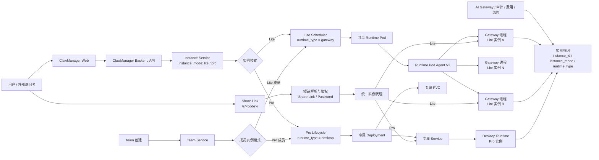

# Lite 模式与 Share Link 开发进度汇报

> 汇报时间：2026-06-11 下午

## 技术实现概览

本次开发的核心是把实例形态从原来的运行时类型，抽象成用户可理解的 `Lite / Pro` 两种模式。

- `Lite`：使用共享 Runtime Pod，在 Pod 内为每个实例创建独立 gateway 进程，适合轻量、低资源成本的使用场景。
- `Pro`：使用独立的 Kubernetes Deployment / Service / PVC，适合需要完整桌面运行环境和独立资源的场景。

后端以 `instance_mode` 作为产品层模式，内部再映射到不同 runtime backend：

- `lite` -> `gateway`
- `pro` -> `desktop`

这样前端、普通实例创建、Team 成员创建、管理端展示和外部访问都统一使用 Lite / Pro 语义；底层调度、代理、资源控制仍然按 gateway / desktop 执行。

Share Link 能力基于实例外部访问表实现，生成 `/s/<code>/` 形式的短链接。短链 code 只在创建时返回，数据库只保存 hash；访问时由 ClawManager 解析短链，再复用现有实例代理链路转发到对应 Lite gateway 或 Pro service。当前支持普通分享链接和密码访问，并支持固定时间、自定义时间和永久有效几类过期策略。

## Lite / Pro 架构图

## 目标

- 新增 Lite 实例模式，让用户在创建普通实例时可以选择 Lite / Pro。
- 保留 Pro 模式的完整桌面实例能力，同时让 Lite 模式复用共享运行时，降低资源占用和启动成本。
- 将 Lite / Pro 模式贯通到 Team 场景，让 Team 成员实例也可以按角色选择 Lite 或 Pro。
- 增加 Share Link 能力，支持将实例访问入口分享给外部用户。
- 建立自动化测试覆盖，保证普通实例、Team 实例和分享访问能力可以持续回归。

## 进展

- 普通实例创建已经支持 Lite / Pro 模式选择。
- Lite 实例创建时会进入共享 gateway runtime 链路，Pro 实例创建时会进入独立 desktop runtime 链路。
- 前端创建页、实例详情页、实例列表和管理端已完成 Lite / Pro 的展示和交互区分。
- Lite 模式下已简化资源配置流程，不再要求用户配置专属 CPU、内存、存储和 GPU；Pro 模式继续保留专属资源配置能力。
- Team 创建流程已经支持为成员选择 Lite / Pro 实例模式。
- Team 成员实例已能按选择的模式创建，并保留后续接入 Team 协作链路所需的基础配置。
- Share Link 已完成基础能力，包括短链接分享、密码访问、过期时间选择和复制入口。
- Share Link 访问已统一走 ClawManager 代理，能够兼容 Lite gateway 和 Pro service 两种后端形态。
- 相关改动已部署到 172.16.1.12 环境，并完成一轮自动化回归。
- 当前自动化测试已覆盖普通实例 Lite / Pro 模式、Share Link 基础行为、管理端模式展示以及 Team Lite 创建链路。
- 联调中发现，部分 Lite runtime / agent 能力仍需补齐，主要集中在 Team 任务消费和 Hermes Lite 会话稳定性上。

## 计划

- 继续推进 agent / runtime 侧补齐 Lite 模式能力，重点包括 Team 任务接收、执行状态回写和会话稳定性。
- 在 agent / runtime 修复后，补充完整的 Team Lite 任务执行 e2e，覆盖从建队、成员实例创建、任务下发到状态回写的闭环。
- 继续完善 Hermes Lite 的联调验证，确保 Lite 模式下聊天、访问和实例生命周期稳定。
- 对 Share Link 增加更完整的回归覆盖，包括短链访问、密码访问、过期策略、禁用/重新生成等场景。
- 在 172.16.1.12 环境继续做端到端回归，确认普通实例、Team 实例和 Share Link 在 Lite / Pro 两种模式下都能稳定运行。
- 最后整理验收说明，明确 Lite / Pro 的支持范围、已验证场景和仍需 agent 侧配合的事项。

## 简短汇报口径

这次开发不是单独做 Team Lite，而是把实例模式整体升级为 Lite / Pro 两种形态。Lite 走共享 runtime gateway，Pro 走独立 desktop runtime，对用户层统一暴露 Lite / Pro，对后端仍按不同 runtime backend 调度。

目前普通实例创建、实例展示、管理端识别、Team 成员创建以及 Share Link 分享能力都已经完成基础支持，并已在 172.16.1.12 做了一轮自动化回归。后续重点是继续和 agent / runtime 侧联调，补齐 Lite 模式下 Team 任务执行闭环和 Hermes Lite 会话稳定性，然后补充更完整的端到端验收测试。
