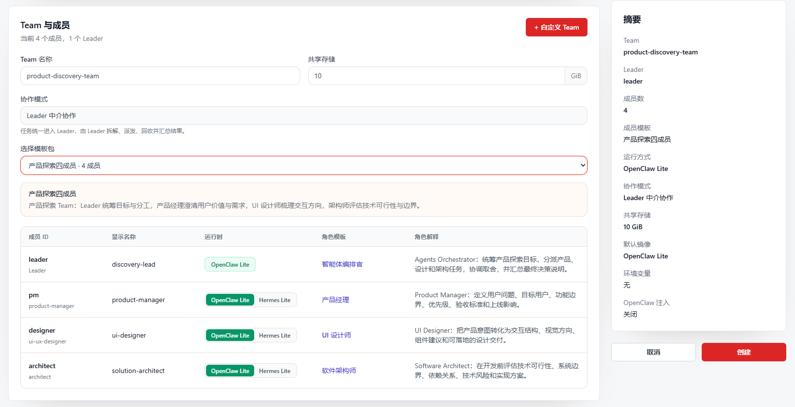
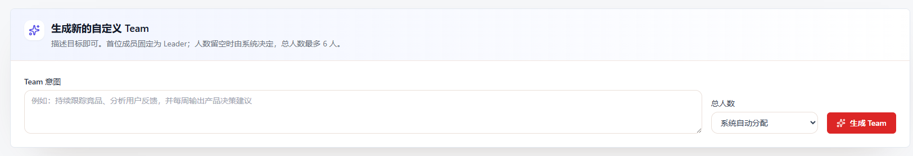
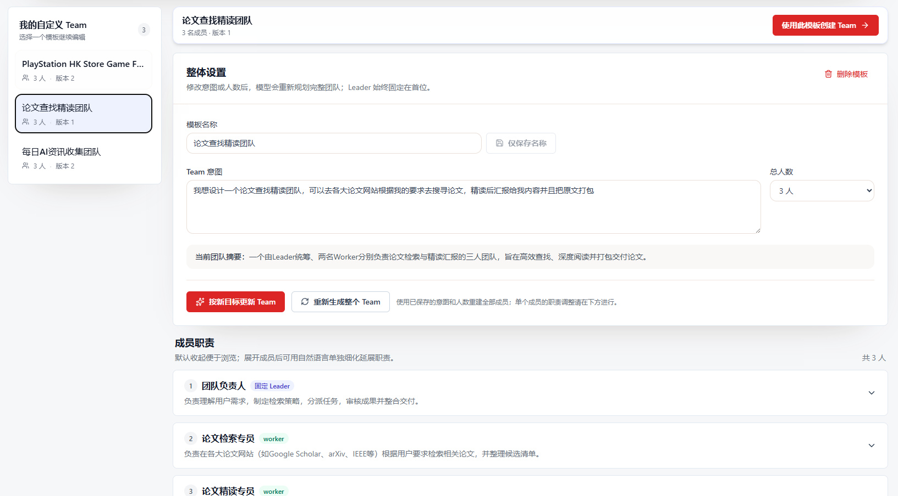
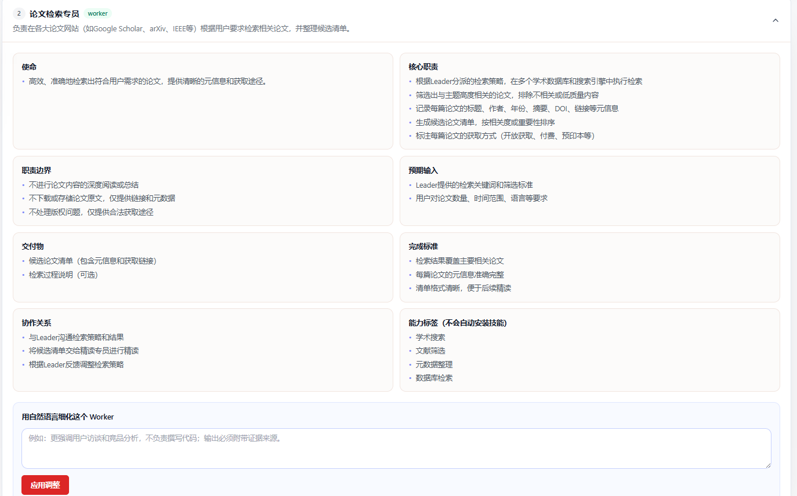

[← 返回 README](../README.zh-CN.md)

# Team 协作快速指南

Team 让一个 OpenClaw Lite Leader 协调多个 Worker 围绕同一目标工作。你可以直接使用只读的固定模板，也可以用自然语言生成自己的 Team 模板。Leader 负责理解目标、拆解和派发任务、回收成员产出、处理异常并交付最终结果。

## 适用范围

- 协作模式固定为 **Leader 中介协作**：用户请求先进入 Leader，再由 Leader 协调成员。
- Leader 固定使用 **OpenClaw Lite**；每个 Worker 可选择 **OpenClaw Lite** 或 **Hermes Lite**。
- 未配置可用 Hermes Lite gateway 镜像时，Hermes Lite 选项会禁用并显示原因。
- 固定模板不可修改或删除；自定义模板归当前用户所有，可以继续调整、删除和复用。

## 1. 使用固定模板创建 Team

1. 在左侧导航打开 **Teams** 并进入创建页面。
2. 填写 Team 名称，按需调整共享存储。
3. 从下拉列表选择模板，并为各个 Worker 选择可用 Runtime。
4. 核对右侧摘要后点击 **创建**。

创建区右上角的 **+ 自定义 Team** 是自定义模板入口；同一页面的成员表中可以选择 Worker Runtime。

当前包含八个只读固定模板：标准双成员、交付三成员、产品探索四成员、质量验收四成员、全栈交付五成员、API 集成五成员、科研成果六成员和软件工程八成员。模板已经定义成员职责和角色配置，无需逐项设置资源预设。

## 2. 生成自定义 Team

打开 **自定义 Team** 后，输入希望团队完成的目标。总人数可以留空由系统自动分配，也可以指定 2–6 人。

生成和职责调整通过当前用户可用的 AI Gateway 执行，使用 `model: "auto"`。实际模型由 AI Gateway 选择，并继承该模型保存的 Thinking 设置；自定义 Team 页面没有单独的 Thinking 开关。没有可用模型时，页面会提示先在模型配置中启用模型。

生成结果始终满足：

- 总人数为 2–6 人。
- 第一位且唯一的 Leader 固定为 `leader`。
- 能力标签只描述适合的能力，不会自动安装 Skill 或改变 Runtime 配置。

## 3. 管理自定义模板

在 **我的自定义 Team** 中选择已有模板后，可以：

- 修改模板名称。
- 修改整体意图或人数，并按新目标更新整个 Team。
- 使用保存的意图和人数重新生成整个 Team。
- 删除模板，或使用该模板进入 Team 创建页。

模板每次更新都会产生新的版本。固定模板不会出现在可编辑列表中。

## 4. 调整成员职责

展开成员后，可以用自然语言调整该成员的领域职责。输入为空时，页面会给出提示，不会提交空调整。

Leader 也可以调整，但只改变主 Leader 模板之外的领域延伸职责。Leader 身份、固定编排能力、当前 Worker 名单及派发、回收、验收和最终汇总关系保持不变。Worker 人数变化后，Leader 仍会通过现有 Team 初始化流程获知完整成员名单和职责。

## 5. 发起和跟踪协作

创建 Team 后，在团队群聊中向 Leader 描述目标。Leader 会制定计划、派发任务、收集交付和 Review 证据并发布最终汇总。Worker 完成只关闭自己的工作项；根任务由 Leader 汇总后完成。

Team 详情页的主要区域包括：

- **团队群聊**：显示计划、派发、有效进度、交付、Review 和最终汇总。
- **Execution Kanban**：顶部显示当前 Query，并展示根任务和成员工作项状态。
- **问题导航**：存在两个及以上问题时可定位历史问题；发送新问题后默认显示最新问题。
- **文件**：浏览共享产物；Markdown、文本和 JSON 可在页面内预览，其他文件可下载。

Monitor 会持续观察活动、完成回执和异常信号，用于提醒和恢复，但不会自行制造任务成功、失败、取消或完成状态。

## 6. Hermes Lite Worker 会话

Hermes Lite Worker 的 Team 对话使用 Hermes 原生会话存储。任务运行时，完整消息和工具结果会逐步出现在 Hermes GUI 中，不需要等任务结束后才查看历史。

从 Team 成员详情或实例列表进入同一 Hermes Lite 实例时，可以查看和继续同一个 Team 会话；普通 Hermes 会话保持原有行为。会话用于交互和观察，Team 状态、Kanban 和完成判定仍以 Team 控制面为准。

## 7. 使用建议

- 优先选择最接近目标的固定模板；需要长期复用的专门分工时再生成自定义模板。
- 在目标中写清范围、数据来源、输出格式和验收标准。
- 不要因 Worker 已交付就重复发送相同任务；等待 Leader 验收和汇总。
- Thinking 可能增加耗时和推理 Token，应在模型管理中按任务需要配置。
