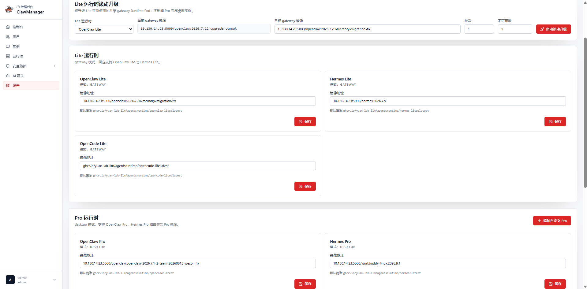

[← README に戻る](../README.ja.md)

# ClawManager ユーザーマニュアル

現在の製品 UI を操作するための中心的な手引きです。一般ユーザーと管理者の基本操作をまとめ、長い専門フローだけを別ガイドに分けます。

## 目次

- [1. デプロイとログイン](#deploy-and-sign-in)
- [2. ロールとナビゲーション](#roles-and-navigation)
- [3. モデル設定](#configure-model-access)
- [4. ワークスペース作成](#create-a-workspace)
- [5. インスタンス操作](#operate-an-instance)
- [6. リソースと Skill](#resources-and-skills)
- [7. Team コラボレーション](#team-collaboration)
- [8. 管理操作](#administration)
- [9. Runtime Image と Lite Rolling Upgrade](#runtime-images-and-rollout)
- [10. AI Gateway と Session Usage](#ai-gateway)
- [11. Security Protection](#security-protection)
- [12. Clipboard と Desktop](#clipboard-and-desktop)
- [13. トラブルシュートと受入確認](#troubleshooting)
- [14. 専門ガイド](#focused-guides)

## 1. デプロイとログイン

k3s / Kubernetes それぞれに Single-Node HostPath と Multi-Node CSI/RWX の 4 profile があります。完全な profile を 1 つだけ適用し、Manifest を混在させたり Multi-Node を一時 HostPath で修復したりしないでください。Workload と PVC の準備後、設定済み URL を開いて管理者が作成したアカウントでログインします。ARM64 を含む詳細は [Deployment Guide](./deployment_ja.md) を参照してください。

## 2. ロールとナビゲーション

ユーザー画面には Workbench、My Instances、Teams、Resource Management、Skill Hub、Settings があります。Resource Management は起動時の資源を準備し、Skill Hub は全対応 Runtime 向けの共通 Version 管理 Skill Catalog です。管理画面には Users、全 Instances、Runtime Pool、Security Protection、AI Gateway、System Settings が追加されます。操作の表示は Role と Quota に依存します。

## 3. モデル設定

**AI Gateway → Models** で通常モデルを 1 つ以上追加・有効化し、Health Test を行います。Security Model は Risk Rule が安全な経路へルーティングする場合だけ必要です。Managed Thinking は制御可能な Provider/Model の永続設定で、Latency と Reasoning Token が増える場合がありますが、非公開の思考内容は表示しません。

## 4. ワークスペース作成

**My Instances → Create** で Runtime と Mode を選択します。

| Runtime | 主な用途 | Lite | Pro |
|---|---|---|---|
| OpenClaw | Conversation、Tool、Scheduled Task、Team Leader/Worker | Shared Pool | Dedicated Desktop |
| Hermes | Hermes Native Session/Tool、Team Worker | Shared Pool | Dedicated Desktop |
| OpenCode | AI Gateway、File、Terminal/Desktop を備えた Coding Workspace | Shared Pool | Dedicated Desktop |
| DeepSeek Harness | AI Gateway、Skill、Workspace File、Native Browser UI を備えた管理対象 Agent Workspace | Shared Pool | Dedicated Webtop |

選択に応じて System Image、Resource Preset または CPU/Memory/Storage、Stream Profile、Environment、Archive、Resource Pack、個別 Resource、初期 Skill が表示されます。Lite はインスタンスごとの Pod を作らず、共有 Runtime Pod 内で隔離 Workspace/Process を動かします。

Skill Hub は OpenCode 専用ではありません。OpenClaw、Hermes、OpenCode、DeepSeek Harness が同じ Catalog を利用し、保存先と Reload 方法だけが Runtime ごとに異なります。作成時に Skill 選択がない場合は、準備完了後に Skill Hub またはインスタンス画面から Install します。

## 5. インスタンス操作

- Start / Stop / Restart は ClawManager から行い、生成された Kubernetes Object を直接変更しません。Environment Override は指定された Restart で適用します。
- Delete 前に必要な File/Archive を保存します。
- Share Link は Credential、期限、Workspace Access を設定し、不要になったら無効化します。
- Workspace は Runtime/Storage が対応する範囲で Browse、Upload、Download、Edit、Delete できます。
- Low / Standard / High は帯域と画質を調整し、保存後は通常 Restart/Apply が必要です。
- Skill Management は実際の Version を確認し、Session Usage は Runtime が報告した値だけを表示します。
- Dedicated Instance では Runtime Overview / Events が診断に使える場合があります。

## 6. リソースと Skill

Resource Management には **Resources**、**Resource Packs**、読み取り専用の **Injection Records** があります。Resources は Channel、Upload Skill、Scheduled Task を扱い、Agent type は現在予約済みです。

Skill Hub は Runtime 横断の Skill 管理・配布基盤です。Browse、My Skills、Ownership、Tag、Version、Scan、Publish、Install、インスタンス側確認を扱います。ZIP は `SKILL.md` を含む必要があり、Scan Failure は修正のため残ります。Scan 完了は自動承認ではありません。OpenClaw、Hermes、OpenCode、DeepSeek Harness が対象です。[Resource Management](./resource-management_ja.md) と [Skill Hub](./skill-hub-guide_ja.md) を参照してください。

## 7. Team コラボレーション

**Teams → Create** で 8 個の変更不可 Built-in Template または Custom Template を選びます。Leader は OpenClaw Lite、Worker は OpenClaw Lite または Hermes Lite です。Custom Team は 2–6 名で、Intent から生成し、名前・Intent・人数の変更、Team 全体再生成、各 Role の自然言語調整、削除、再利用ができます。Leader の調整は Domain Role を拡張するだけで、Delegation、Result Collection、Final Report を削除しません。

Chat、最新 Query の Execution Kanban、Files、Artifacts、Member Delivery、Final Result を同じ画面で確認できます。新しい質問は最新 Task Group を既定で選択します。[Team Guide](./team-workspaces-guide_ja.md) を参照してください。

## 8. 管理操作

Users では Account、Role、Quota、CSV Import、Instances では全体検索と Lifecycle、Runtime では共有 Pod、Capacity、Health、Maintenance Drain を扱います。Settings は Image と Lite Rollout を管理します。Security Protection と AI Gateway は Resource Management とは別の管理領域です。

## 9. Runtime Image と Lite Rolling Upgrade

**Admin Console → Settings** を開きます。

1. Lite/Pro Card で Image を入力し **Save**。これは将来の Provisioning 設定を保存するだけで、稼働中 Lite Pod は置換しません。
2. 稼働 Pool を更新するには上部の **Lite Runtime Rolling Upgrade** で OpenClaw Lite、Hermes Lite、OpenCode Lite、DeepSeek Harness Lite を選び、Current/Target Image、Batch、Max Unavailable を確認します。
3. **Start Rolling Upgrade** で Drain と Replace を順次実行します。
4. 完了後に Runtime Health と Test Instance を確認します。

Batch が大きいほど速い一方、利用可能 Capacity は減ります。Drain 中に Active Lite Session が中断される可能性があるため、保守時間と控えめな値を使用します。Pro Image の Save は既存 Pro Instance を自動置換しません。

## 10. AI Gateway と Session Usage

5 つの領域は Models、AI Audit、Costs、Session Usage、Risk Rules です。Session Usage は観測画面であり、Conversation Editor や請求台帳ではありません。期間、User、Runtime、Instance、Session で Filter し、報告済み Input/Output/Cached/Reasoning Token を比較します。Request 単位の根拠は AI Audit で確認します。[AI Gateway Guide](./aigateway_ja.md) を参照してください。

## 11. Security Protection

Security Protection は独立した管理画面です。Alert Metric、Event、Pod Live Aegis、Export、Emergency Control、KSecure Model をまとめ、詳細ページで Runtime Defense、Isolation、Trust、Identity/Egress、Policy、Collaboration、Quota/Approval、Skill Scanner、Audit を扱います。ユーザーは Skill Hub で Scan 状態を確認し、管理者はここで Scanner Health と Security Evidence を管理します。[Security Guide](./security-platform_ja.md) を参照してください。

## 12. Clipboard と Desktop

Clipboard は Runtime Image により双方向、Host→Desktop のみ、無効のいずれかです。変更には通常 Restart が必要です。ASCII の次に Unicode/CJK をテストしてください。Clipboard と Keyboard/IME は別経路で、Browser Permission も影響します。Password/API Key をテストに使わないでください。

## 13. トラブルシュートと受入確認

| 症状 | 確認項目 |
|---|---|
| Runtime/Image がない | Image の Save と Enable。 |
| 保存した Lite Image が稼働していない | Rolling Upgrade も開始する。 |
| Model がない | 通常モデルを 1 つ以上有効化。 |
| Lite に専用 Pod がない | 正常。共有 Runtime Pod を使用。 |
| PVC Pending | Profile、StorageClass、AccessMode、Node Label、Capacity。 |
| Skill が見えない | Version/Path、Refresh、必要な Runtime Reload。 |
| Session Usage が空 | 期間/Filter と Runtime Report。 |

受入確認では Workload/PVC、通常 Model、公開 Runtime ごとの Test Instance、Lifecycle/File、Skill Install、AI Audit/Session Usage、Team 利用時の Chat/Kanban/File/Result を検証します。

## 14. 専門ガイド

- [Deployment](./deployment_ja.md)
- [Team](./team-workspaces-guide_ja.md)
- [AI Gateway](./aigateway_ja.md)
- [Security Protection](./security-platform_ja.md)
- [Resource Management](./resource-management_ja.md)
- [Skill Hub](./skill-hub-guide_ja.md)
- [OpenCode Workspace](./opencode-lite-pro-agent-development_ja.md)
